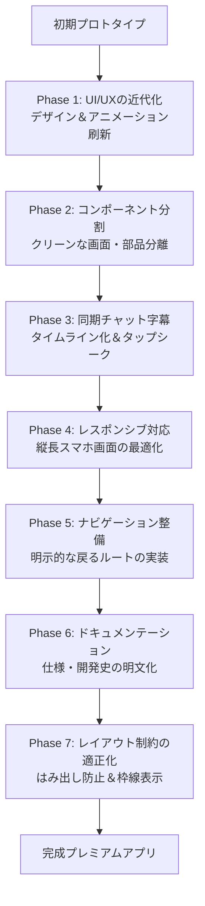

# アプリケーション開発ストーリー (STORY.md)

このドキュメントは、本アプリケーション「video_study_platform」が初期のプロトタイプから現在の洗練されたモダンアプリへ進化するまでの開発プロセスと、AIセッションにおけるタスク管理・ペアプログラミングの軌跡をまとめたものです。

---

## 🎬 開発ロードマップの概要



---

## 📖 各フェーズの開発ストーリーとAI作業管理

### 【初期状態】素朴なプロトタイプ
- **状態**: 必要最低限の動画再生とテキスト字幕が表示されるだけのシンプルなアプリ。
- **課題**: 画面内の余白が崩れており、グラデーションの箱がぽつんと浮かぶホーム画面、再生と停止ボタンが離れて配置された無骨な再生画面など、ユーザー体験（UX）と見た目（UI）の洗練度が非常に低い状態でした。

---

### 【Phase 1】UI/UXの大幅な近代化（プレミアムデザインの導入）
AIはユーザーの「見た目を改善して」というリクエストに対し、Material 3ベースの配色と独自のダークスペーステーマを採用したモダンプレミアムなUI設計図を作成し、承認を得てから実装を開始しました。

- **ホーム画面の刷新**:
  - 背景に淡いグラデーションを敷き、中央にソフトシャドウと大きな角丸を施した白いライブラリカードを配置。
  - リスト要素をカード化し、再生時間バッジやグラデーション付きの再生アイコンを適用。
  - リフレッシュ完了時の演出をSnackBarに置き換え。
- **ビデオプレイヤーの映画館風デザイン**:
  - 再生画面の背景を深い宇宙を思わせるダークネイビー（`#0F111E`）にし、プレイヤーを角丸にして光彩風の枠線と深い影を配置。
  - 右側のコントロールを半透明（ガラスモルフィズム風）のカードにし、再生/一時停止ボタンをネオン調のグラデーション円形ボタンに刷新。
- **シークバーと字幕**:
  - `CustomSeekBar` に分・秒の時間インジケータを追加し、つまみ（サム）とスライダー色をシアンで統一。
  - `SubTitleDisplay` を半透明ブラックのバブルにし、字幕の有無で枠線やフォントが滑らかにアニメーションする仕様へ変更。
- **品質維持**: 
  - Flutter 3.22以降で非推奨となった `withOpacity` をすべて `.withValues(alpha: ...)` に先回りして置き換え、静的解析エラー・警告を完全にクリーンアップしました。

---

### 【Phase 2】コードのクリーンアップとコンポーネント分割リファクタリング
デザインが美しくなった一方で、`video_screen.dart` や `home_screen.dart` の単一ファイル内のコード長が肥大化したため、ユーザーの提案によりコンポーネント分割（Refactoring）を実施しました。

- **ロジックとUIの完全分離（構造の維持）**:
  - 主要な変数（`videoList` や `VideoPlayerController`）と状態の watch ロジックは元の Screen クラスにそのまま保持。
  - 描画UIのみを `lib/interfaces/widgets/` 配下の小コンポーネントへ適切に抽出。
  - **分割されたWidget**:
    - `VideoPlayerView`: 左側のプレイヤーとシークバー。
    - `VideoControlPanel`: 右側のコントロールと字幕。
    - `VideoLibraryCard`: ホーム画面のライブラリカード。

---

### 【Phase 3】チャット字幕タイムライン ＆ タップ・シーク機能
「字幕をチャット風にし、タップでその時間にシークさせたい」というユーザーの高度なUXリクエストに応えるため、AIは字幕モジュールの全面的な作り直しを提案しました。

- **タイムラインと自動スクロール**:
  - 再生時間（`position`）より前に発話されたすべての字幕を抽出して `ListView` でチャット履歴のように時系列表示。
  - 新しい字幕が発出されると、リストが自動で最下部へとスムーズに追従スクロール。
- **シーク（再生位置の即時ジャンプ）の実装**:
  - 各字幕バブルを `InkWell` でタップ可能にし、タップ時に `controller.seekTo(subtitle.start)` を実行。これにより、動画とシークバー、字幕の全状態が瞬時に同期します。
  - 最新のバブルは鮮やかなプライマリコンテナカラーで強調し、過去のバブルは透過させて視覚的コントラストを形成。

---

### 【Phase 4】レスポンシブ対応（スマホ縦長画面の最適化）
Webデプロイやスマートフォンでの利用を想定し、画面が縦長になった場合にレイアウトが崩れず使いやすくなるよう、レスポンシブデザインを組み込みました。

- **縦並びへの動的変形**:
  - デバイスサイズから `isPortrait == true` を検知。
  - 縦型時はプレイヤー（`VideoPlayerView`）を上にアスペクト比を保って置き、その下の残りスペース全体に `VideoControlPanel(isPortrait: true)` を `Expanded` で配置。
- **要素の並び順の反転**:
  - 縦長時は、操作ボタンが自然と親指の届く「真ん中」に来るように、パネル内の並び順を `[再生コントロール ➜ 字幕ディスプレイ]` の順に自動反転させました。

---

### 【Phase 7】レイアウト制約の適正化 ＆ 境界の視覚的明確化（はみ出し防止＆白枠線）
字幕のチャットバブルが領域および画面外にはみ出してしまい、一部スクロール不能になるレイアウト問題を解決しました。

- **レイアウト制約（制約伝播）の適正化**:
  - `SubTitleDisplay` に設定されていた `SizedBox(height: 260)` による固定高さ指定をすべて廃止。
  - 親である `VideoControlPanel` にて、`subtitleSection` およびその中の `SubTitleDisplay` を `Expanded` でラップ。これにより、デバイスサイズに応じた最適な高さを字幕ディスプレイが自動的に占有するよう設計を変更。
- **字幕ディスプレイ領域の視覚的明確化（白枠線の追加）**:
  - 字幕ディスプレイ全体を半透明の黒背景（`Colors.black.withValues(alpha: 0.2)`）と白枠線（`Colors.white.withValues(alpha: 0.15)`）で囲んだカード型の `Container` に変更。
  - `clipBehavior: Clip.antiAlias` を設定することで、チャットバブルやインクウェル効果が角丸の白枠線からはみ出ないように厳密に制御しました。

---

## 🤖 AIセッションにおける作業管理プロセス

本プロジェクトの開発では、AIエージェントのベストプラクティスに基づいた**「Planning Mode」**を用いた段階的なセッション管理が行われました。

1. **Research (調査段階)**
   - 既存のFlutterプロジェクトのコード、テーマ、ルーター設定、および依存パッケージをコマンドやファイルビューアで綿密に調査。

2. **Create Implementation Plan (計画の提示と合意)**
   - 変更を加える前に、AIが ```implementation_plan.md``` を作成・更新。
   - ユーザーに技術的アプローチ（Widget分割方法やレスポンシブ構造など）を提示し、**ユーザーの明示的な承認（Approved）**を得るプロセスを徹底。

3. **Task Tracking (タスクの視覚的管理)**
   - 承認後、```task.md``` を作成し、現在どの作業を行っているかを `[ ]` (未着手), `[/]` (進行中), `[x]` (完了) のステータスで管理。

4. **Verify & Walkthrough (動作確認と記録)**
   - 変更のたびに `flutter analyze` による静的解析を実施し、Webビルドを含む全環境での警告・エラーが完全にゼロであることを確認。
   - 変更概要を ```walkthrough.md``` に詳細に記録し、常にユーザーへ透過的に成果をレポートしました。

---

## 🏆 開発のまとめ
このAIセッションを通じて、単に「見た目を綺麗にする」だけでなく、「コードを綺麗に分割する（リファクタリング）」「チャット風の新しい学習UXを創る」「スマホでもPCでも快適に動く（レスポンシブ）」といった、商用アプリレベルの高品質なプロダクトへ最短ルートで成長させることができました。
ユーザーとAIの緊密なフィードバックループが機能した、極めて理想的なペアプログラミングセッションでした。
